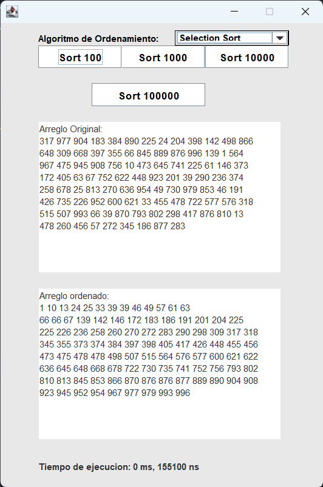

# Programa de Java para Ordenamiento Lineal y Paralelo

Este programa de Java permite realizar ordenamiento lineal y paralelo de arreglos de números. Proporciona una interfaz gráfica de usuario que permite elegir entre diferentes algoritmos de ordenamiento y tamaños de arreglo.

  

## Características

- Interfaz gráfica intuitiva para facilitar la selección de opciones.
- Algoritmos de ordenamiento lineal disponibles: selección, inserción, burbuja, mezcla y quicksort.
- Algoritmos de ordenamiento paralelo disponibles: quicksort paralelo y mezcla paralela.
- Posibilidad de elegir el tamaño del arreglo de números: 100, 1000, 10000 o 100000 elementos.
- Visualización del tiempo de ejecución en milisegundos y nanosegundos para cada algoritmo seleccionado.
- Comparación en tiempo real del rendimiento entre los algoritmos lineales y paralelos.

## Requisitos del sistema

- Java 8 o superior.
- IntelliJ IDEA (opcional, solo para desarrollo).

## Instrucciones de uso

1. Clona este repositorio en tu máquina local.
2. Abre el proyecto en IntelliJ IDEA (opcional).
3. Compila el proyecto y genera el archivo JAR.
4. Ejecuta el archivo JAR generado.
5. Utiliza la interfaz gráfica para seleccionar el algoritmo de ordenamiento y el tamaño del arreglo.
6. Observa los resultados, el tiempo de ejecución en milisegundos y nanosegundos para cada algoritmo.

## Contribuciones

Las contribuciones son bienvenidas. Si deseas colaborar en el proyecto, sigue los siguientes pasos:

1. Crea un fork del repositorio.
2. Crea una rama nueva para tu contribución: `git checkout -b nombre-de-la-rama`.
3. Realiza tus cambios y mejoras.
4. Realiza commits descriptivos: `git commit -m "Descripción de los cambios"`.
5. Envía tus cambios al repositorio remoto: `git push origin nombre-de-la-rama`.
6. Abre un Pull Request explicando tus cambios.

## Licencia

Este proyecto está bajo la licencia [MIT License](LICENSE).

## Contacto

Si tienes alguna pregunta o sugerencia, no dudes en ponerte en contacto conmigo a través de [correo electrónico](mailto:tu-correo-electronico@example.com).

Espero que esta versión actualizada del archivo `README.md` cumpla con tus requerimientos. Asegúrate de reemplazar `images/program-interface.png` con la ruta de la imagen real de tu proyecto.
